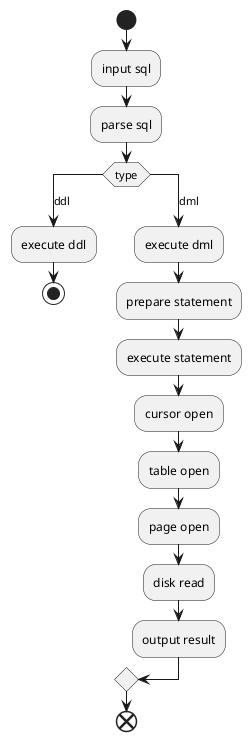

# Let's Build a Simple Database

[View rendered tutorial](https://cstack.github.io/db_tutorial/) (with more details on what this is.)

## Notes to myself

Run site locally:
```
bundle exec jekyll serve
```

## flowchart



## commands

```bash
# go test ./...
# cd gov && go test -v
```
